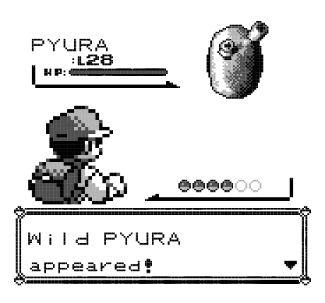

A big interest of mine away from research is art, and I have recently dabbled in SciArt, hoping to bridge the gap between art and science. Despite my limited skills, I find creating small pieces of artwork to be extremely satisfying and a nice change of pace from the normal academic (well, PhD) life.

I believe the link between science and art is extremely important. I think having an appreciation of artistic concepts improves figures in acadmeic pieces of work. Illustrations are also a great way of dissemminating information to non-specialists (and specialists) in a way that is both accessible and (hopefully) memorable. As the adage goes, a picture paints a thousand words.

## 8-bit 

I love the simplicity of 8-bit style drawings, they are a bit of fun, but I think their simplicity makes them suitable for poster and oral presentations too. Here are a few examples.

Because field work is just real life Pokemon isn't it?



## Comic style art

Comic style piecies hopefully show that not all scientists take themselves (or their research) too seriously.


